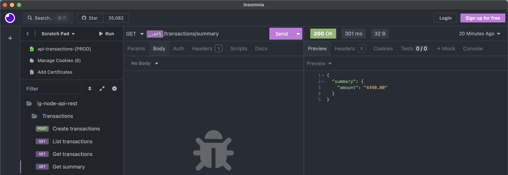

  <div style="display: flex; flex-direction: column;
  align-items: center;">
  
  </div>

<h3 align="center">
  API-REST for financial transactions with registered users.
</h3>

---

[We are ONLINE on RENDER, try Now](https://api-rest-transactions-rfl2.onrender.com) :point_left:

<br>

<p align="center">
  <a href="#test_tube-technologies">Technologies</a>&nbsp;&nbsp;&nbsp;|&nbsp;&nbsp;&nbsp;
  <a href="#rocket-Getting-started">Getting started</a>&nbsp;&nbsp;&nbsp;|&nbsp;&nbsp;&nbsp;
  <a href="#desktop_computer-Project">Project</a>&nbsp;&nbsp;&nbsp;|&nbsp;&nbsp;&nbsp;
  <a href="#bookmark-Layout">Layout</a>&nbsp;&nbsp;&nbsp;|&nbsp;&nbsp;&nbsp;
  <a href="#sunny-result">Result</a>
</p>

## :test_tube: Technologies

This project was developed using the following technologies:

- [Node.JS](https://nodejs.org/)
- [Fatify](https://fastify.dev/)
- [TypeScript](https://www.typescriptlang.org/)
- [Zod](https://zod.dev/)
- [Knex](https://knexjs.org/)
- [Vitest](https://vitest.dev/)
- [SQlite](https://www.sqlite.org/)
- [Supertest](https://github.com/ladjs/supertest)

## :rocket: Getting started

To clone and run this application, you'll need [Git](https://git-scm.com), Node.js v22.11.0 or higher + npm v10.9.0 or higher installed on your computer. From your command line:

Clone the project and access the folder

```bash
$ https://github.com/Ivo-Jr/api-rest-transactions.git && cd api-rest-transactions
```

Follow the steps below

```bash
# Install the dependencies
$ npm i

# Start the project
$ npm run dev
```

## :desktop_computer: Project

This API-REST simulates the transactions of registered users, making it possible to record entires, exits, search for specific transactions and monitor the financial balance.

## :sunny: Result

<h3>Responsive Layout:<h3>

  <div style="display: flex; flex-direction: column;
  align-items: center; justify-content: center; margin-bottom: 20px">

  <div style="width: 100%; max-width: 800px">
  
  
  
  
  </div>

  </div>

---

<p align="center">Made with ❤ by Ivo Jr</p>
